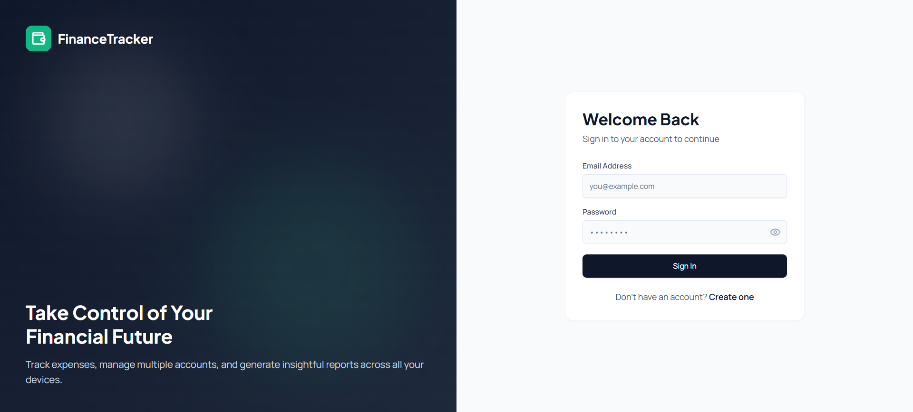
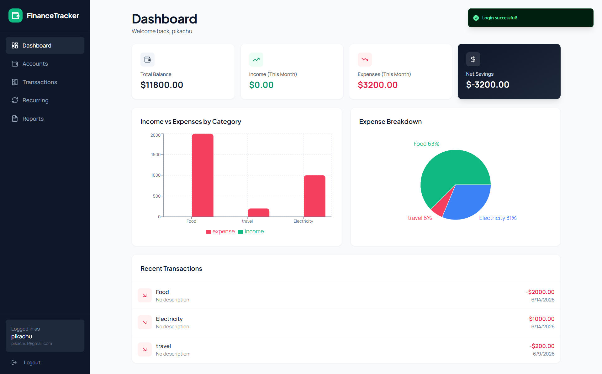
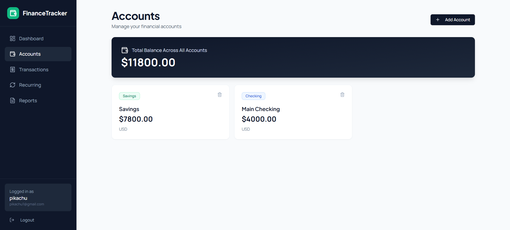
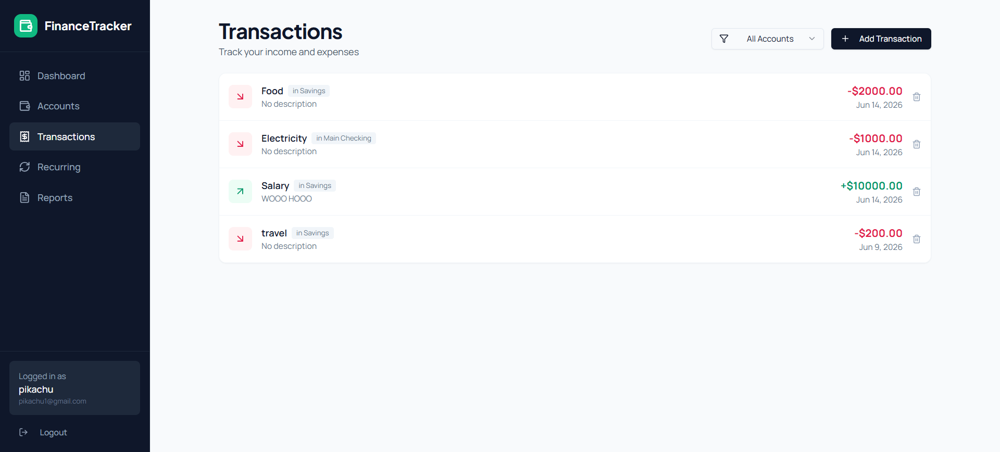
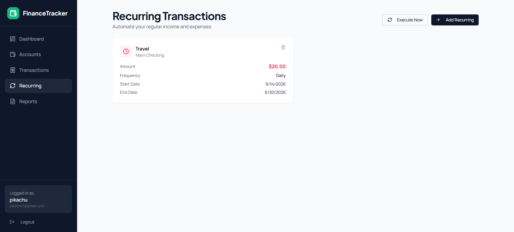
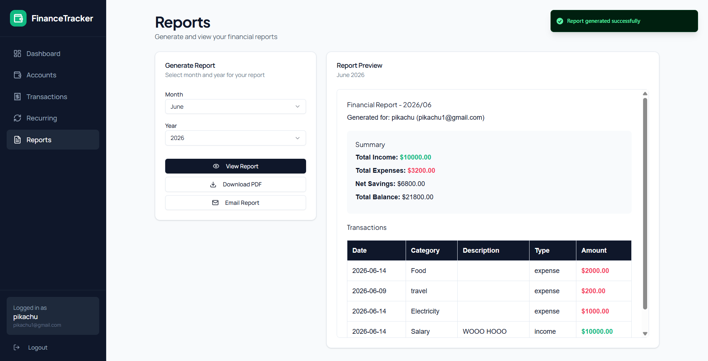
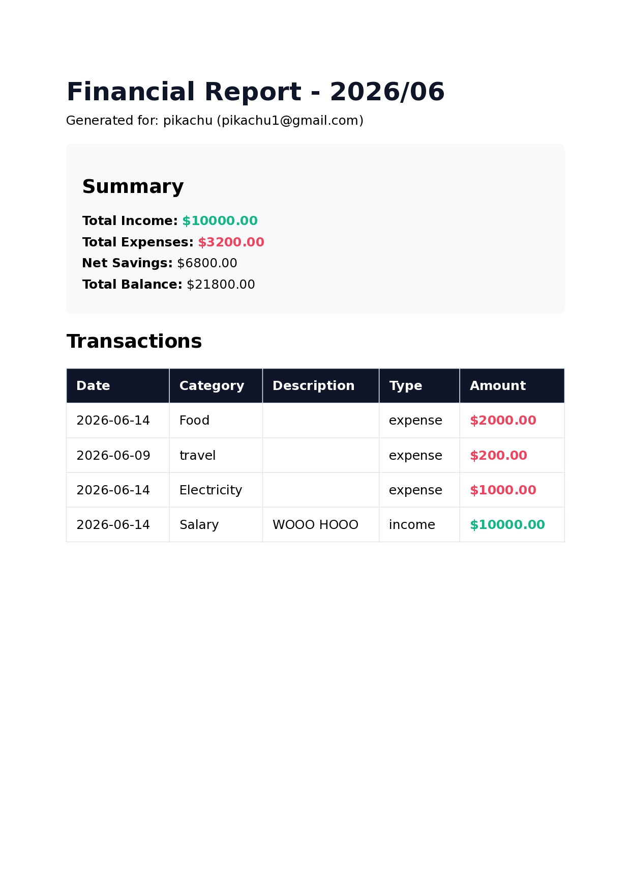

# Finance Tracker

A full-stack personal finance tracking application built with FastAPI, MongoDB, and React. The application allows users to manage expenses, categorize transactions, generate reports, export PDF summaries, and receive email-based communications.

The application is fully containerized using Docker and Docker Compose for consistent local development and deployment.

## Screenshots

### Sign In



### Dashboard



### Accounts



### Transactions



### Recurring



### Reports



## Sample Report


[Download Sample PDF](docs/sample-report.pdf)

## Features

* User authentication with JWT
* Expense and transaction tracking
* MongoDB persistence
* PDF report generation using WeasyPrint
* Email integration using Resend
* Dockerized deployment
* Production-ready frontend build with Vite

## Tech Stack

### Frontend

* React
* Vite

### Backend

* FastAPI
* Motor (MongoDB Async Driver)
* JWT Authentication
* WeasyPrint
* Resend

### Infrastructure

* Docker
* Docker Compose
* MongoDB

---

## Development Notes

This project was initially generated using Emergent as a starting point. The application was subsequently customized and improved through manual development, including:

* Migration and refinement of the Vite frontend build process
* Docker and Docker Compose containerization
* Dependency cleanup and optimization
* Container image size reduction from approximately 1.5 GB to 392 MB
* Environment configuration improvements
* Bug fixes and runtime stability enhancements
* Deployment and local development workflow improvements

The project serves as an example of adapting and productionizing an AI-generated codebase through software engineering practices, debugging, optimization, and deployment work.

---

## Docker Image Optimization

During containerization, the application image was optimized significantly to reduce build size and improve deployment efficiency.

### Optimization Summary

| Stage                 | Image Size |
| --------------------- | ---------- |
| Initial Build         | ~1.53 GB   |
| Dependency Cleanup    | ~755 MB    |
| Final Optimized Build | ~392 MB    |

### Changes Made

* Removed unused AI-related dependencies
* Removed development-only packages from production requirements
* Eliminated unused SDKs and libraries
* Removed GCC/G++ compiler toolchain from the runtime image
* Retained only required runtime dependencies for WeasyPrint
* Kept frontend assets in a separate build stage
* Reduced Python dependency footprint substantially

### Result

* Reduced image size by approximately **74%**
* Faster image pulls
* Reduced storage usage
* Improved deployment efficiency
* Smaller attack surface

---

## Prerequisites

* Docker
* Docker Compose

Verify installation:

```bash
docker --version
docker compose version
```

---

## Environment Configuration

Copy the example environment file:

```bash
cp .env.example .env
```

Update the values as needed.

Example:

```env
# Frontend
VITE_BACKEND_URL=http://localhost:8001

# Authentication
JWT_SECRET_KEY=your-super-secret-jwt-secret

# Email
RESEND_API_KEY=re_xxxxxxxxxxxxxxxxx
SENDER_EMAIL=onboarding@resend.dev

# Database
MONGO_URL=mongodb://mongodb:27017
DB_NAME=finance_tracker

# CORS
CORS_ORIGINS=*
```

---

## Build and Run

Build the application:

```bash
docker compose build
```

Start all services:

```bash
docker compose up -d
```

View running containers:

```bash
docker ps
```

View logs:

```bash
docker compose logs -f
```

Stop the application:

```bash
docker compose down
```

---

## Access the Application

Frontend:

```text
http://localhost:8001
```

MongoDB:

```text
mongodb://localhost:27017
```

## Project Structure

```text
.
├── frontend/
├── backend/
├── Dockerfile
├── docker-compose.yml
├── .env.example
└── README.md
```